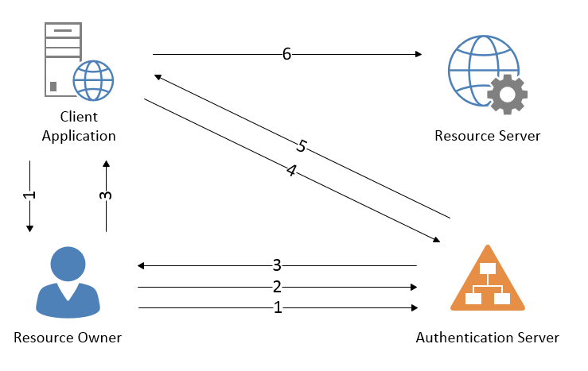


# Authorization Code Flow

As a Facebook user you upload data to your profile, 
some is displayed publically and some is private. 
This information is a resource which you may want to share with third party applications. 
You as the user are the resource owner and only you have the credentials required to access 
these resources. Because those credentials are all that is required to prove your identity, 
you don’t want to disclose those to a third party application and that’s where OAuth comes into play. 

OAuth specifies ways to grant access to a resource. 
This diagram corresponds to the authorization code grant which is used to delegate access to the resource server.

1. The client application initiates the flow by directing the resource owner to the authentication server.
1. The resource owner authenticates with the auth server through their user-agent. 
  - The client app plays no part in the authentication process and never sees the user’s credentials
1. The auth server returns an authorization code to the client app, via a redirect. 
  - This is not an access token and does NOT provide access to the resource server
1. The client application shows the authentication server the authorization code and the authentication server returns an access token
  - Optionally a refresh token
1. The client application can now access the resource server with the access token

#### Why is this a good thing?

- The resource owner never discloses credentials to the client application
- The authorization token is never given to the resource owner, or rather, the resources owner’s user agent
